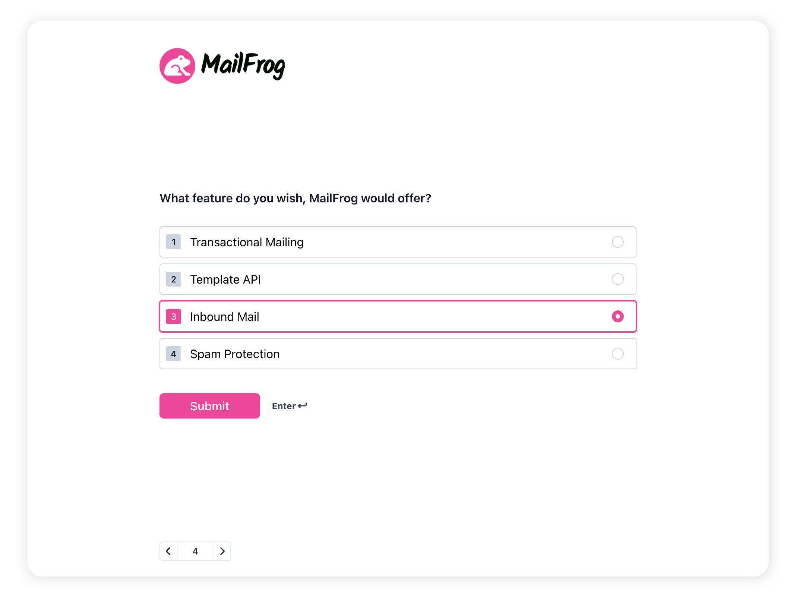

<p align="center">   

</p>
<p align="center">
<i>Input is a no-code application to create simple & clean forms.<br> With our customization options, you can let the forms shine in your brands colors.</i>

</p>

## Why Input?

Input aims to be an alternative to proven tools like TypeForm, with the added benefit of self-hosting and having brandable forms out of the box.

We started Input out of a previous project called BotReach, which was already a conversational form tool, but closed-source. We plan to release a feature complete first MVP of Input in Q2 2022.

> We are in an early stage of developing and some of our planned features are currently not in the codebase. You can contact us via philipp@deck9.co to get on the waitlist or if you want to contribute to the development.

## Development

We are using [Laravel Sail](https://laravel.com/docs/master/sail) to develop Input. You need Docker already installed on your machine to run the entire app. We also recommend installing Node.JS and NPM directly on your host machine to make working with frontend assets more convenient.

-   [Docker](https://www.docker.com/get-started/)
-   [NodeJS](https://nodejs.org/) v18 (mise installs it from `mise.toml`)
-   [mise-en-place](https://mise.jdx.dev/) (for task automation)

### Download

Clone the source of this repository with the following command:

```bash
git clone git@github.com:deck9/input.git
```

### Configuration

Copy the `.env.dev.example` file to `.env`. The defaults work as they are. The `up` task below sets `APP_KEY` when it is empty.

```bash
cp .env.dev.example .env
```

### Running

Make sure that your Docker agent is running. There are several steps necessary to build the app for the first time. To simplify these tasks, we use mise-en-place. Just run the following command, and all build steps will run automatically:

```bash
mise run up
```

It installs the Composer packages, starts Sail and waits until the containers are healthy, runs the migrations, generates `APP_KEY` only if it is empty, installs the npm packages and starts Vite. You can run it again at any time. The app runs at http://localhost:8500.

### Vite

The `up` task ends with the Vite dev server. To start it again later:

```bash
npm run dev
```

### S3 Storage

Uploads are stored on the local disk by default. To test S3 storage, Sail can start [RustFS](https://github.com/rustfs/rustfs), an S3-compatible server, with the compose profile `s3`:

1. In `.env`, set `FILESYSTEM_DRIVER=minio` and uncomment the S3 lines below it.
2. Run `./vendor/bin/sail up -d`. `COMPOSE_PROFILES=s3` starts the `rustfs` service too.
3. Create the bucket once:

```bash
./vendor/bin/sail artisan tinker --execute='Storage::disk("minio")->getClient()->createBucket(["Bucket" => "input"])'
```

### Sail Bash Alias

It is recommended to create a bash alias, to make working with Laravel Sail simple as possible. To do this, you can check out the [Laravel docs](https://laravel.com/docs/9.x/sail#configuring-a-bash-alias) on this topic or just add the following alias to your `.bashrc` or `.zshrc`:

```bash
alias sail='[ -f sail ] && bash sail || bash vendor/bin/sail'
```

With the alias, you can quickly perform tasks on the App Docker Container:

```bash
sail up -d # start container
sail artisan tinker # use laravel artisan commands
sail artisan migrate # run database migrations
sail artisan test # run phpunit
sail composer {args} # use composer
```

## Production Deployment

Input runs from the Docker image `ghcr.io/deck9/input`. The guides are in `docs/`:

-   [Quick Start](docs/quick-start.md): one container with SQLite
-   [Docker Compose for Production](docs/hosting/docker-compose.md): MariaDB, Redis and S3 storage
-   [Configuration](docs/hosting/configuration.md): database, queue worker, scheduler and mail
-   [Proxy Setup / TLS](docs/hosting/proxy-setup.md): Nginx, Caddy, allowed host and trusted proxies
-   [Backups and Updates](docs/hosting/backups.md)
-   [Feature Limitations](docs/hosting/limitations.md)
